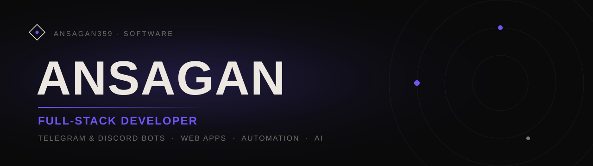

<h3 align="center">Full-stack developer crafting premium software — bots, web apps, automation &amp; AI.</h3>

  
  

---

### About

I build reliable, well-crafted software end to end — from Telegram &amp; Discord bots and automation scripts to full web applications and AI integrations. I care about clean architecture, performance and details that make a product feel premium.

- 🛠 &nbsp;Turning ideas into shipped, maintainable products
- ⚡ &nbsp;Obsessed with performance, clean code and great UX
- 🌍 &nbsp;Working with clients worldwide · English &amp; Russian
- 💬 &nbsp;Ask me about bots, automation, web apps and AI

 

### Tech I work with

  
  
  
  
  
  
  
  
  
  

 

### Featured projects

| Project | What it is | Links |
| --- | --- | --- |
| **Ledgerly** | A private expense tracker: categories, canvas chart, CSV export — offline. | [Live demo](https://ansagan359.github.io/expense-tracker/) · [Code](https://github.com/Ansagan359/expense-tracker) |
| **TaskFlow** | A calm kanban board with drag &amp; drop — vanilla JS, offline-first. | [Live demo](https://ansagan359.github.io/taskflow-board/) · [Code](https://github.com/Ansagan359/taskflow-board) |
| **MiniCRM** | A lightweight client tracker: deal pipeline, live search and totals. | [Live demo](https://ansagan359.github.io/mini-crm/) · [Code](https://github.com/Ansagan359/mini-crm) |
| **Slotly** | An appointment booking widget with live slot availability. | [Live demo](https://ansagan359.github.io/booking-widget/) · [Code](https://github.com/Ansagan359/booking-widget) |
| **Invoicer** | Invoice generator with live preview and print-to-PDF — no watermarks. | [Live demo](https://ansagan359.github.io/invoice-generator/) · [Code](https://github.com/Ansagan359/invoice-generator) |
| **Streaks** | Habit tracker with GitHub-style heatmaps and streak counting. | [Live demo](https://ansagan359.github.io/habit-tracker/) · [Code](https://github.com/Ansagan359/habit-tracker) |

### Bots &amp; automation

| Project | Description | |
| --- | --- | --- |
| **Telegram Shop Bot** | Storefront bot: catalog, cart, order flow — aiogram 3, Docker. | [Code](https://github.com/Ansagan359/telegram-shop-bot) |
| **Telegram Support Bot** | FAQ answers + ticket hand-off to a human via /reply. | [Code](https://github.com/Ansagan359/telegram-support-bot) |
| **Telegram Bot Starter** | Production-ready aiogram 3 boilerplate to build bots fast. | [Code](https://github.com/Ansagan359/telegram-bot-starter) |
| **Price Monitor** | Tracks competitor prices, alerts changes to Telegram — stdlib only. | [Code](https://github.com/Ansagan359/price-monitor) |
| **Daily Report Bot** | Turns a sales CSV into a daily Telegram summary on a schedule. | [Code](https://github.com/Ansagan359/daily-report-bot) |
| **Folder Backup** | Timestamped zip backups with rotation — one file, stdlib only. | [Code](https://github.com/Ansagan359/folder-backup) |
| **Smart File Organizer** | Zero-dependency CLI that sorts folders, with dry-run &amp; undo. | [Code](https://github.com/Ansagan359/smart-file-organizer) |

### Small tools, live in the browser

| | | |
| --- | --- | --- |
| [JSONeye](https://ansagan359.github.io/json-visualizer/) — JSON tree visualizer | [Squeezr](https://ansagan359.github.io/image-compressor/) — private image compressor | [Kursi](https://ansagan359.github.io/currency-converter/) — currency converter |
| [Notedown](https://ansagan359.github.io/markdown-notes/) — markdown notes | [TextKit](https://ansagan359.github.io/text-toolkit/) — text toolkit | [Pomodoro](https://ansagan359.github.io/pomodoro-timer/) — focus timer |
| [Password Generator](https://ansagan359.github.io/password-generator/) — Web Crypto | [Weather Dashboard](https://ansagan359.github.io/weather-dashboard/) — 7-day forecast | [URL Shortener](https://github.com/Ansagan359/url-shortener) — Node/Express |

 

### GitHub stats

  
  

 

  <i>Open to freelance & collaboration — let's build something worth showing off.</i>

